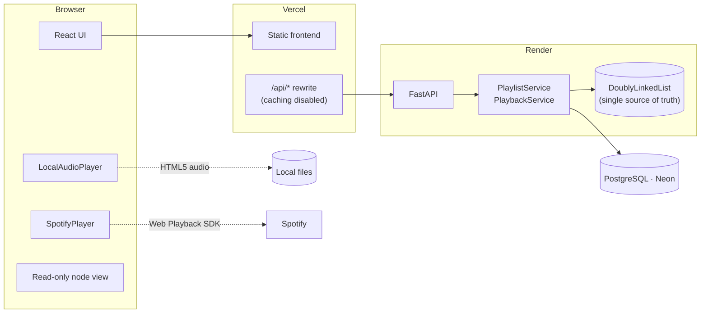
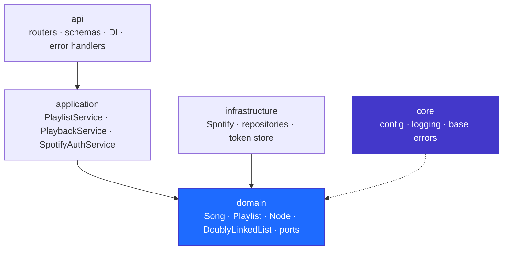
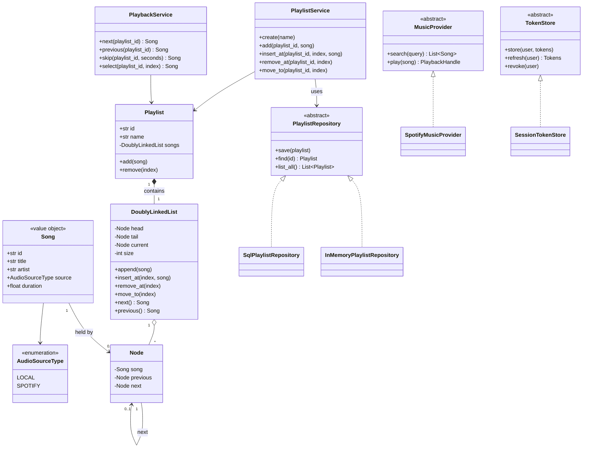
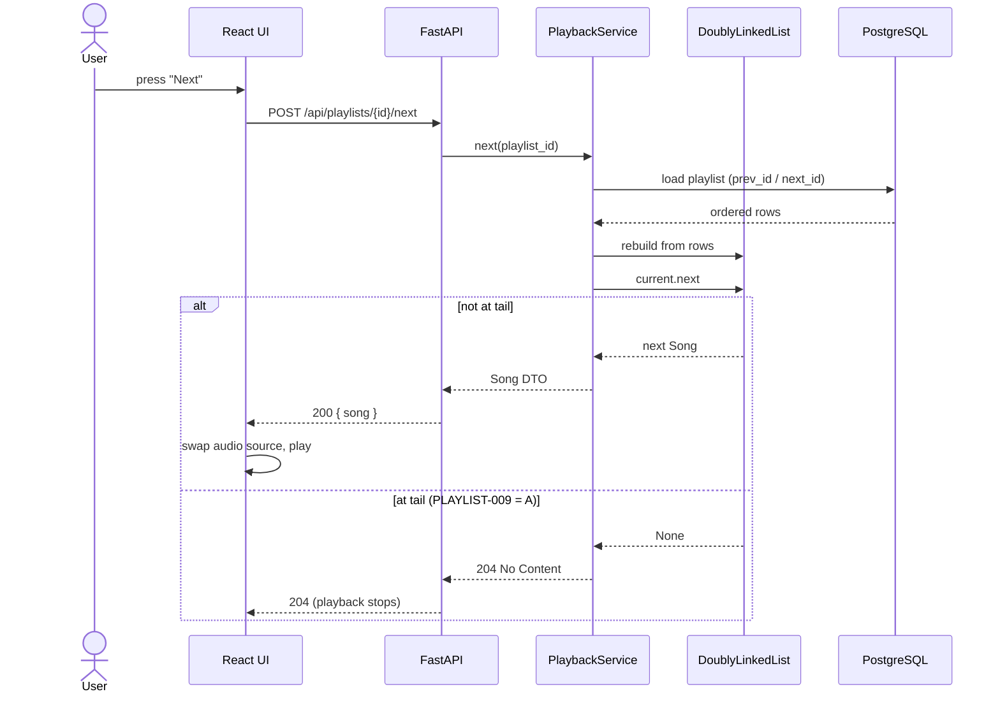
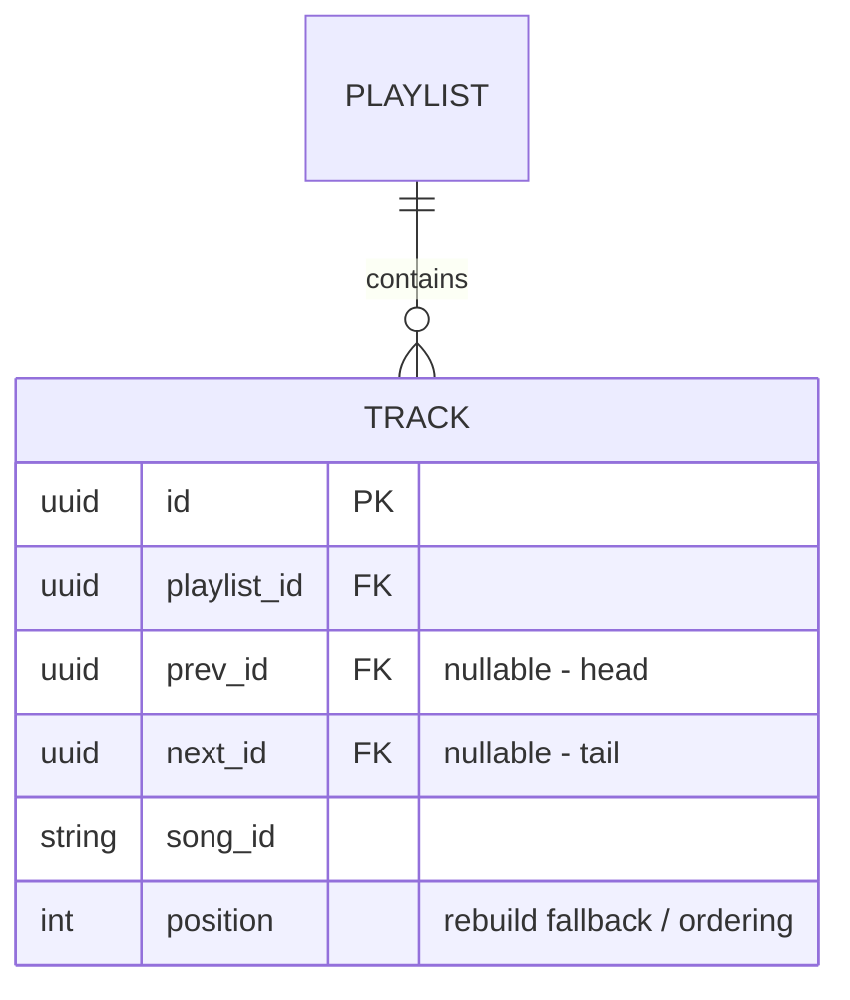

# MigMusic — Architecture

> Source of truth for requirements and decisions: [`AGEND.md`](../AGEND.md).
> Architectural decisions are recorded as ADRs in [`docs/adr/`](adr/).

## 1. Overview

MigMusic is a web music player whose core data structure is a **doubly linked
list**. It plays **local files** (never uploaded to the server) and **Spotify**
tracks (OAuth + Web Playback SDK), persists playlists server-side, and exposes a
didactic node view for the academic defence.

## 2. Layers and dependency direction

| Layer | May import | Must never import |
|---|---|---|
| `domain` | Python standard library, typing | FastAPI, SQLAlchemy, `os.environ`, HTTP |
| `application` | `domain`, ports (`ABC`) | concrete adapters, routers |
| `infrastructure` | `domain`, third-party SDKs | `api`, `application` internals |
| `api` | `application`, Pydantic, FastAPI | `domain` internals bypassing services |
| `main.py` | everything (composition root) | — |

Enforced mechanically: `ruff` (import rules) + strict `mypy` run in CI.

## 3. Class diagram

## 4. Sequence — next track (option A: list lives in the backend)

## 5. Persistence model

`DB-003 = B`: the linked order is stored as neighbour pointers, and the list is
reconstructed on load.

`prev_id`/`next_id` are **nullable**: the head has `prev_id = NULL` and the tail
has `next_id = NULL`, which is exactly the stop-at-the-edges behaviour required
by `PLAYLIST-009 = A` (no circular list).

## 6. Key decisions

| Decision | ADR |
|---|---|
| Doubly linked list lives in the Python backend | [ADR-001](adr/ADR-001-doubly-linked-list-location.md) |
| Hexagonal layers + dependency injection | [ADR-002](adr/ADR-002-hexagonal-layered-architecture.md) |
| Single origin through a Vercel rewrite proxy | [ADR-003](adr/ADR-003-single-origin-deployment.md) |
| Playlist order persisted as `prev_id`/`next_id` | [ADR-004](adr/ADR-004-playlist-persistence.md) |

## 7. Design patterns in use

Strategy (audio sources) · Repository (persistence) · Factory (players and
providers) · Adapter (Spotify) · Observer (player state → UI) · Dependency
Injection (`main.py` composition root).
